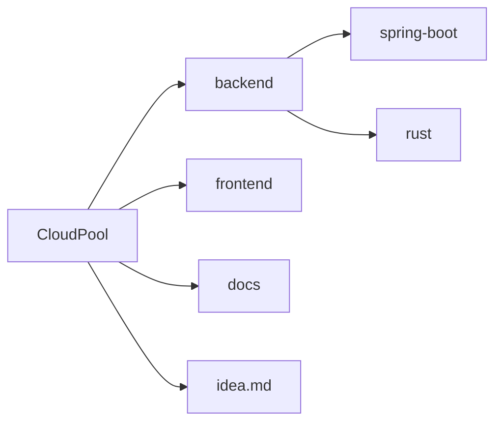

<div align="center">
  <h1>CloudPool</h1>
  <p><strong>Developer Infrastructure Orchestration & Decentralized BaaS Platform</strong></p>
  
  [](LICENSE)
  [](https://java.com/)
  [](https://www.rust-lang.org/)
  [](https://spring.io/projects/spring-boot)


</div>

---

# Overview

CloudPool is an open-source **Developer Infrastructure Orchestration Platform** designed to unify backend services into a single programmable infrastructure layer.

Rather than replacing existing cloud providers, CloudPool orchestrates and abstracts infrastructure components through a centralized control plane capable of:

- Dynamic database provisioning
- Hybrid storage pooling
- Embedded vector indexing
- Infrastructure state versioning
- Secure local-to-cloud connectivity
- Native Rust acceleration via JNI

The platform combines the flexibility of **Spring Boot orchestration** with the execution performance of **Rust-native extensions**.

---

# Core Features

## Infrastructure Orchestration

- Dynamic PostgreSQL provisioning
- Redis cache orchestration
- Embedded H2 development environments
- Multi-tenant infrastructure isolation
- Unified infrastructure control layer

---

## Hybrid Storage Pooling

- External storage provider integration
- Local fallback storage engine
- Expirable access token management
- Distributed storage abstraction

Supported providers include:

- Google Drive
- Local disk storage

---

## Native Rust Performance Layer

Critical execution paths are implemented in Rust and exposed through JNI:

- SHA-256 hashing
- zstd / Gzip compression
- Vector mathematics
- Cosine similarity search
- Zero-copy transformations

---

## Dynamic Provisioning Engine

- Runtime schema generation
- Dynamic table creation
- Raw SQL execution
- Live infrastructure mutation
- Runtime reconfiguration

---

## Infrastructure Rollback & Versioning

- Snapshot-based state tracking
- Infrastructure history auditing
- Schema version management
- Real-time rollback support

---

## Embedded Vector Search

- Native Weaviate integration
- Semantic text chunk indexing
- Local vector fallback engine
- Rust-powered cosine similarity

---

# System Architecture

CloudPool follows a hybrid polyglot architecture optimized for orchestration flexibility and native execution performance.

```mermaid
flowchart TD

    A[Frontend Dashboard<br/>Vanilla JS SPA]

    A --> B[Spring Boot Orchestration Layer]

    B --> C[GraphQL API]
    B --> D[REST API]
    B --> E[Multi-Tenant Infrastructure Engine]
    B --> F[Dynamic Provisioning Engine]

    B --> G[JNI / FFI Bridge]

    G --> H[Native Rust Runtime]

    H --> I[Compression Engine]
    H --> J[SHA-256 Hashing]
    H --> K[Vector Math Engine]
    H --> L[Cosine Similarity Search]

    B --> M[(PostgreSQL)]
    B --> N[(Redis)]
    B --> O[(H2 Local DB)]

    B --> P[Weaviate Vector Engine]

    B --> Q[Hybrid Storage Pool]

    Q --> R[Google Drive]
    Q --> S[Local Disk Storage]
````

---

# Infrastructure Request Flow

```mermaid
sequenceDiagram

    participant User
    participant Dashboard
    participant SpringBoot
    participant RustCore
    participant Database
    participant Storage

    User->>Dashboard: Infrastructure Request

    Dashboard->>SpringBoot: GraphQL / REST Request

    SpringBoot->>Database: Provision Schema
    SpringBoot->>Storage: Allocate Storage Pool

    SpringBoot->>RustCore: Execute Native Operations

    RustCore-->>SpringBoot: Compression / Vector Results

    SpringBoot-->>Dashboard: Infrastructure State Response

    Dashboard-->>User: Updated Control Plane State
```

---

# Repository Structure



---

# Technology Stack

| Layer                 | Technologies           |
| --------------------- | ---------------------- |
| Backend Orchestration | Java 21, Spring Boot 3 |
| Native Runtime        | Rust                   |
| APIs                  | GraphQL, REST          |
| Database              | PostgreSQL, H2         |
| Cache Layer           | Redis                  |
| Vector Search         | Weaviate               |
| Frontend              | Vanilla JavaScript     |
| Interop Layer         | JNI / FFI              |

---

# Getting Started

## Prerequisites

Install the following dependencies:

* Java JDK 17 or 21
* Rust 1.70+
* Cargo
* Maven

---

# Build Instructions

## 1. Clone Repository

```bash
git clone https://github.com/Mr-Charvaka/CloudPool.git

cd CloudPool
```

---

## 2. Compile Native Rust Module

```bash
cd backend/rust

cargo build --release
```

Generated binaries will appear inside:

```text
target/release/
```

Examples:

* `.dll` → Windows
* `.so` → Linux
* `.dylib` → macOS

---

## 3. Validate JNI Integration

```bash
cd ../spring-boot

../../apache-maven-3.9.6/bin/mvn exec:java \
-Dexec.mainClass="com.cloudpool.util.JniTest"
```

---

## 4. Start CloudPool

```bash
../../apache-maven-3.9.6/bin/mvn spring-boot:run \
-Dspring-boot.run.profiles=local
```

---

# Local Development Environment

The default `local` profile enables:

* Embedded H2 databases
* Local vector indexing
* Standalone storage fallback
* Development GraphQL playground

---

# Access Points

| Service             | URL                              |
| ------------------- | -------------------------------- |
| Developer Console   | http://localhost:8080/index.html |
| GraphQL Endpoint    | http://localhost:8080/graphql    |
| GraphiQL Playground | http://localhost:8080/graphiql   |
| H2 Console          | http://localhost:8080/h2-console |

---

# Documentation

Additional documentation is available inside:

```text
/docs
```

Including:

* GraphQL schemas
* REST API specifications
* Infrastructure architecture
* Database design
* Deployment notes
* JNI / FFI implementation details

---

# Performance Philosophy

CloudPool intentionally separates:

* High-level orchestration logic
* Low-level compute-intensive execution paths

This architecture enables:

* Rapid backend feature development
* Native-speed execution
* Reduced JVM overhead
* Cleaner scalability boundaries

---

# Development Roadmap

## Planned Features

* Kubernetes deployment orchestration
* Distributed worker nodes
* WASM runtime plugins
* Multi-node storage replication
* Infrastructure graph visualization
* Real-time metrics dashboard
* Edge runtime execution engine

---

# Contributing

We welcome open-source contributions.

Areas currently open for contribution:

* Rust FFI optimizations
* GraphQL improvements
* Frontend dashboard enhancements
* Infrastructure provisioning adapters
* Documentation improvements
* Vector indexing pipelines

---

## Contribution Workflow

```bash
# Fork repository

# Create feature branch
git checkout -b feature/my-feature

# Commit changes
git commit -m "feat: add new infrastructure module"

# Push changes
git push origin feature/my-feature
```

Please follow:

* Conventional Commits
* Clean architecture principles
* Minimal dependency philosophy

---

# License

Licensed under the Apache License 2.0.

See:

```text
LICENSE
```

---

# Vision

CloudPool aims to become a programmable infrastructure layer where developers can orchestrate databases, storage systems, vector engines, and execution runtimes through a unified high-performance control plane.

The project focuses on combining:

* Infrastructure abstraction
* Native execution performance
* Open-source extensibility
* Developer-first orchestration

```
```
